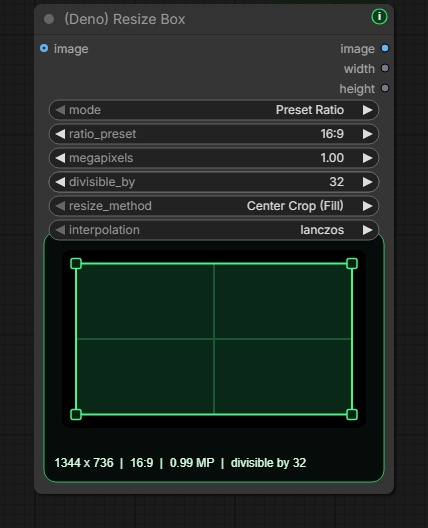

# Deno Custom Nodes

[English](../README.md) | [한국어](README.ko.md) | [日本語](README.ja.md) | [简体中文](README.zh-CN.md) | [Español](README.es.md) | [Português](README.pt-PT.md) | [Português (Brasil)](README.pt-BR.md) | [Bahasa Indonesia](README.id.md)

[YouTube Channel](https://www.youtube.com/@Denoise-AI)

Deno Custom Nodes 是一组面向 ComfyUI 实际制作流程的自定义节点，帮助图像、视频、LTX、RTX、模型准备等重复任务变得更快、更清晰、更适合日常使用。大多数 Deno 节点都带有一个小的绿色 `i` 按钮，可以在不离开 ComfyUI 画布的情况下查看节点说明。

## Release Notes

公开更新记录在 [CHANGELOG.md](../CHANGELOG.md) 中保持简洁。

## Web Tools

这些工具可以直接在浏览器中运行。

- [DENO Video Compare](https://deno2026.github.io/comfyui-deno-custom-nodes/video-compare/) - 用滑块、并排、差异和切换视图比较两个渲染视频。
- [DENO Video to GIF/WebP](https://deno2026.github.io/comfyui-deno-custom-nodes/video-to-gif/) - 裁剪、截取、缩放短视频，并导出为 GIF 或更小的 WebP。

## DENO Visual Fold


DENO Visual Fold 是用于整理大型 ComfyUI 图的视觉辅助功能。折叠节点或组不会改变工作流逻辑。

选择两个或更多节点时，画布右上附近会出现绿色 `Fold` 按钮。点击后，所选节点会折叠成一个紧凑的视觉组，并可用 `Unfold` 恢复。选择一个普通 ComfyUI 组时，可以用 `Fold Group` 折叠组内节点；选择多个组时，还会出现对齐操作。

ComfyUI Subgraph 会把节点移动到子图中，而 Visual Fold 只做视觉整理。当你希望 `Get` / `Set` 节点或父子图结构仍留在主图中时，它更适合。

## Included Nodes

### `(Deno) Resize Box`

ComfyUI 的分辨率辅助与图像缩放节点。



主要功能：比例预设、手动输入、基于百万像素的尺寸计算、`divisible_by` 对齐、Center Crop 与 Fit 缩放、节点内比例预览、`image`、`width`、`height` 输出。

### `(Deno) Multi Image Loader`

面向批量参考图工作流的多图加载器。


主要功能：固定高度图库、拖拽排序、上传、拖放、粘贴图像、浏览 ComfyUI `input` 文件夹、支持嵌套文件夹、按最新修改时间排序、保持比例/预设/手动缩放、`multi_output`、`width`、`height` 输出。

### `(Deno) Advanced Image Source Loader`

适合需要外部文件夹、本地路径、网络图片 URL 和混合尺寸图像列表的高级图像源加载器。


主要功能：支持 ComfyUI `input` 与外部本地文件夹、URL/Path 输入、上传与粘贴、缩略图启用/禁用、拖拽排序、masonry 样式图库、递归文件夹加载、batch tensor 与 `image_list` 输出。

### `(Deno) Image Compare`

在 ComfyUI 画布中快速比较两张图像的 A/B 对比节点。


主要功能：比较 `image_a` 与 `image_b`，Slider/Side by Side/Difference/Toggle 模式，悬停滑块，A/B 标签，Swap 按钮，可随节点尺寸变化的内部预览。

### `(Deno) Video Compare`

用于在 ComfyUI 画布中检查超分辨率和 FPS 插帧结果的视频 A/B 对比节点。

主要功能：`video_a`、`video_b`，可选 `audio_a`、`audio_b`，Slider/Side by Side/Difference/Toggle 模式，播放/暂停，时间轴拖动，逐帧步进，速度，循环，输出徽章开关，`comparison` 图像输出。

如果运行节点太重，也可以使用浏览器工具：https://deno2026.github.io/comfyui-deno-custom-nodes/video-compare/


### `(Deno) Video Preview`

用于在图中任意位置查看真实编码视频输出的全分辨率预览节点。


主要功能：IMAGE batch 输入与直通输出，可选音频 mux，悬停播放音频，点击播放/暂停，Full screen 按钮，分辨率/FPS/帧数/时长信息徽章，缺少 PyAV 时显示清晰安装提示。

### `(Deno) RTX Video Super Resolution`

面向 Windows/NVIDIA RTX 用户的可选辅助节点，用于在 ComfyUI 中尝试 NVIDIA RTX Video Super Resolution。


新手流程：安装或更新 `deno-custom-nodes`，启动 ComfyUI，添加节点并运行一次。如果提示缺少 NVIDIA VFX，完全关闭 ComfyUI，点击 `How to install` 并按网页指南操作。BAT 显示路径时确认它位于刚关闭的 ComfyUI 目录内，再输入 `Y`，完成后重启 ComfyUI。

NVIDIA 官方链接：[NVIDIA Maxine Windows Getting Started](https://docs.nvidia.com/deeplearning/maxine/vfx-sdk-programming-guide/index.html)，[RTX Video FAQ](https://nvidia.custhelp.com/app/answers/detail/a_id/5448/~/rtx-video-faq)。

### `(Deno) RTX Video Super Resolution (2 Pass)`

面向完整视频流程的 2-pass RTX 处理节点。可以先执行同尺寸的 `Denoise` 或 `Deblur`，再执行 `VSR` 或 `High Bitrate` 超分辨率处理。

示例工作流：[RTX 2-pass upscale workflow](workflows/deno-rtx-lowram-metabatch.json)

主要功能：包含 Low System Memory 与 High System Memory 两条路线，低内存路线使用 VHS Meta Batch 分块处理长视频，保留源 FPS 和音频，更适合实际视频输出收尾。

### `(Deno) LTX Sequencer`

面向多图 LTX 工作流的 guide sequencer。


主要功能：配合 `(Deno) Multi Image Loader` 的 batch 输出使用，可自动填充 `num_images`，保留 sync 风格工作流，只在需要时手动控制 strength，通过 bypass 快速做 A/B 测试。

### `(Deno) LTX Model Loader`

把常见 LTX 2.3 模型加载模式整理到一个紧凑节点中。


主要功能：Checkpoint Style、KJ Style、GGUF Style，输出 `model`、`clip`、`video_vae`、`audio_vae`，尽量使用 ComfyUI 内置加载路径，并兼容 KJNodes 与 ComfyUI-GGUF。

### `(Deno) Easy Model Download Helper`

基于预设的模型文件安装辅助工具。内置 LTX 2.3 8GB VRAM GGUF 入门文件组。


主要功能：在浏览器中打开官方模型链接而不是让 Python 下载，显示 ComfyUI 模型根目录，在 workflow 中保存 creator preset，支持 Hugging Face 与 Civitai 链接，检查目标模型文件是否已放在正确位置。


### `(Deno) LTX Multi LoRA Loader`

面向 LTX 工作流的 Power-LoRA 风格多 LoRA 加载器。


主要功能：在一个节点中添加多个 LoRA，逐槽启用，分别设置 strength、video、audio strength，管理 trigger word 与 LoRA note，复制触发词，输出修补后的 `model` 与 `clip`。

### `(Deno) LTX Prompt Guide`

整合 LTX prompt encoding、可选 negative prompt、内置 LTX conditioning 与对白长度规划的提示词辅助节点。


主要功能：positive prompt 编码，可折叠 negative prompt，带 `frame_rate` 的 LTX conditioning，根据引号内对白估算最小视频长度，支持 Auto、Korean、English、Japanese、Chinese 估算。

### `(Deno) Bernini Prompt Guide`

面向 KJ-style Bernini prompt prefix 的提示词辅助节点。它把 positive/negative prompt encoding 放在一个更适合新手的节点中，并在节点顶部显示当前 `System Prompt` 模式对应的 system prompt。


主要功能：可读的 `Text to Video`、`Image to Video`、`Reference Video Edit` 等 System Prompt 选择，reference 模式中的 `image0` / `image1` naming hint，可折叠 negative prompt，Official Wan2.2 negative preset 自动填充，`positive` / `negative` 输出。

Negative preset 不是输出模式，而是自动填充下方 negative prompt 输入框。用 preset 填充后，用户可以直接编辑该输入框，最终编辑后的内容会被编码为 negative conditioning。

提示词建议像给聊天机器人下指令一样书写，而不是只堆标签。例如：`Replace the jacket with the shirt from image0. Keep the camera motion, background, lighting, and shadows unchanged.`

注意：此节点只准备 text conditioning。Bernini visual conditioning 仍需要支持 Bernini context latent 的 ComfyUI/KJ 后端。
在该后端支持仍处于 ComfyUI draft PR 阶段时，请只在复制出来的测试用 portable ComfyUI 文件夹中使用 `tools/DENO_Bernini_Preview_Backend_Update.bat`。

## Why This Exists

这些节点的目标是减少实际 ComfyUI 制作中反复出现的设置摩擦。重点不是堆功能，而是让每天重复的工作流更快、更清晰、更容易教学。

## Search Tips

可在 GitHub、ComfyUI Manager 和 Registry 中搜索：`deno custom nodes`、`rtx video super resolution`、`nvidia vfx`、`image compare`、`video compare`、`video preview`、`video to gif`、`gif webp`、`ltx 2.3`、`ltx model loader`、`ltx multi lora`、`bernini`、`bernini prompt guide`、`reference video edit`、`wan2.2`、`visual fold`。

## Install

在 ComfyUI 的 `custom_nodes` 文件夹中运行：

```bash
git clone https://github.com/Deno2026/comfyui-deno-custom-nodes.git
```

然后重启 ComfyUI。

## Links

- YouTube: https://www.youtube.com/@Denoise-AI
- GitHub: https://github.com/Deno2026/comfyui-deno-custom-nodes
- Registry: https://registry.comfy.org/publishers/deno2026/nodes/deno-custom-nodes
