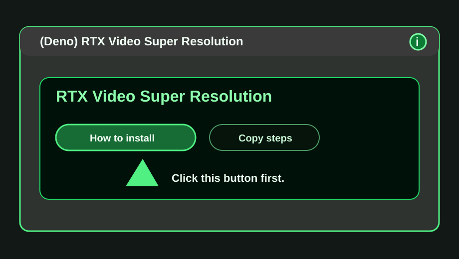
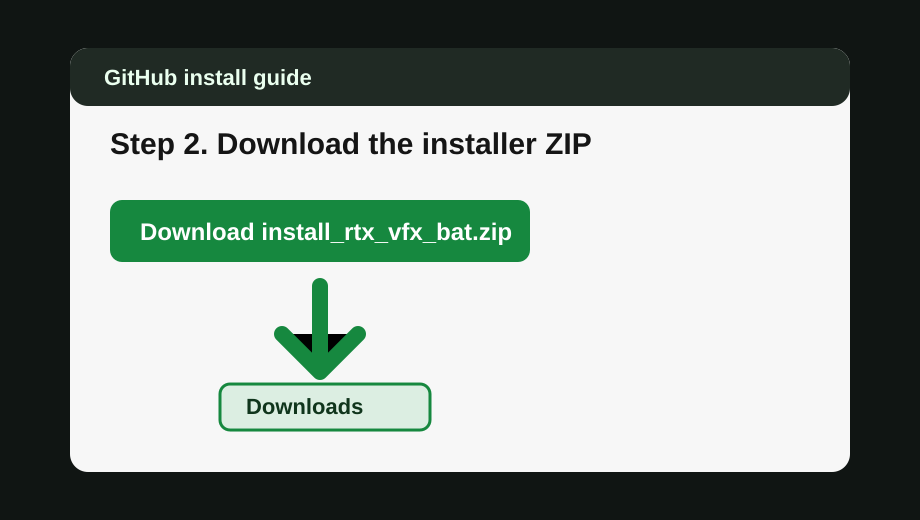
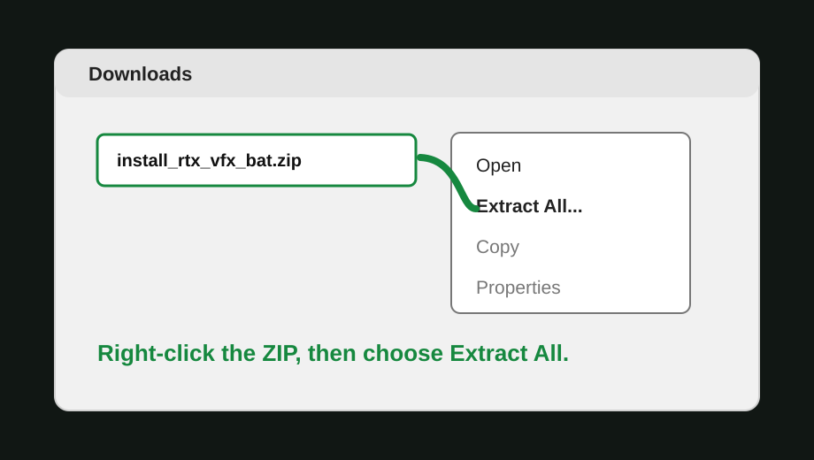
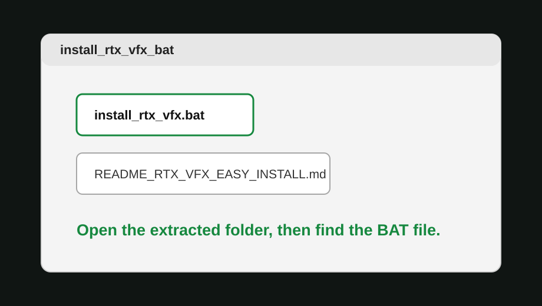
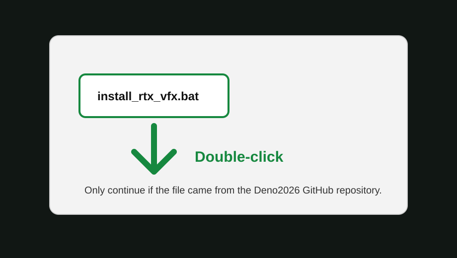
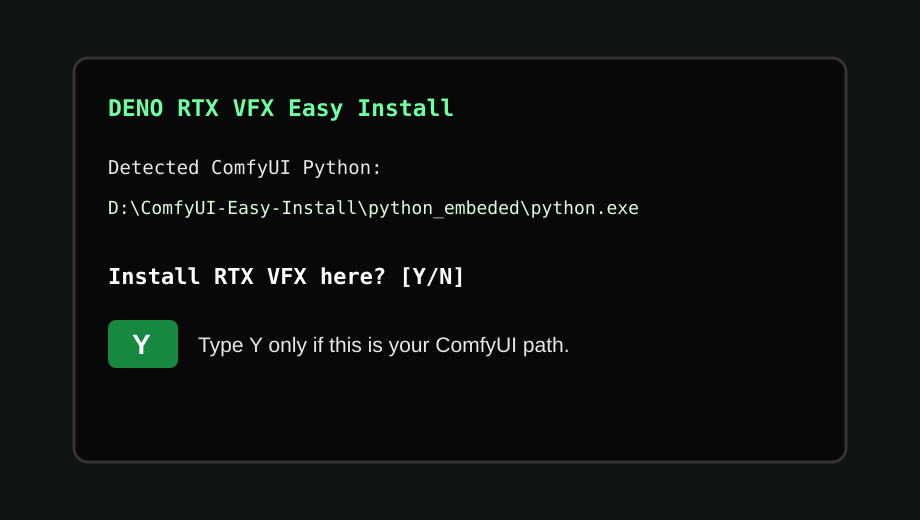
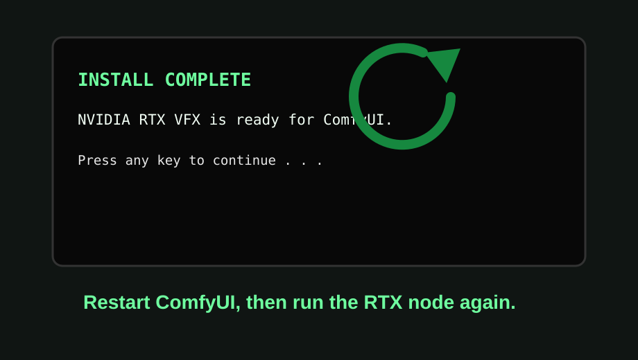

# DENO RTX VFX Install Guide

Prefer the standalone visual web page:

<https://deno2026.github.io/comfyui-deno-custom-nodes/rtx-vfx-install/>

This guide is for Windows users who installed `deno-custom-nodes` from ComfyUI Manager and need NVIDIA RTX VFX for:

- `(Deno) RTX Video Super Resolution`
- `(Deno) RTX Video Super Resolution (2 Pass)`

The ComfyUI Manager package does not include the installer BAT file. The RTX node opens the standalone visual web page instead, so the install steps stay easy to follow without putting installer scripts inside the Registry package.

## If You Are a Beginner, Copy This Into GPT First

If installing BAT/ZIP files feels confusing, copy the prompt below and paste it into ChatGPT or another GPT assistant. Ask it to guide you one step at a time while you look at your own Windows screen.

```text
I am a beginner using ComfyUI on Windows.

Please guide me step by step to install DENO RTX VFX for the ComfyUI node:
(Deno) RTX Video Super Resolution.

Use this official DENO visual install page as the source:
https://deno2026.github.io/comfyui-deno-custom-nodes/rtx-vfx-install/

Important safety checks:
1. Tell me to download only from the official Deno2026 GitHub repository.
2. Explain that the installer prepares NVIDIA's official nvidia-vfx Python package from NVIDIA's package index, https://pypi.nvidia.com.
3. Tell me not to run any BAT file from an unknown mirror, reupload, Discord attachment, or random website.
4. Tell me to close every ComfyUI window before running the installer.
5. Tell me that the ZIP may first download to my Windows Downloads folder.
6. Tell me to open my ComfyUI folder, then open custom_nodes\deno-custom-nodes\tools\.
7. Tell me to move install_rtx_vfx_bat.zip into the deno-custom-nodes\tools folder before extracting it.
8. Tell me to right-click the ZIP inside tools, choose Extract All, and run install_rtx_vfx.bat only from the extracted installer files inside tools.
9. When the black installer window shows a Windows path and asks "Install RTX VFX here?", help me check that the path is inside my ComfyUI app before I type Y.
10. If the path looks wrong, tell me to type N and stop instead of guessing.
11. After INSTALL COMPLETE, tell me to fully restart ComfyUI before testing the node again.

Please do not skip steps. Ask me what I see on screen after each step.
```

This GPT prompt is only a helper. It cannot guarantee safety by itself. The real safety rule is simple: use the official Deno2026 GitHub links on this page, check that the shown Windows path belongs to the ComfyUI app you just closed, and do not run installer files from unknown sources.

## Before You Start

- Use Windows 10 or Windows 11.
- Use an NVIDIA RTX GPU.
- Update your NVIDIA driver if it is old.
- Close every ComfyUI window before running the installer.
- Only download the ZIP from this Deno2026 GitHub repository.
- The installer uses NVIDIA's official `nvidia-vfx` Python package path from `https://pypi.nvidia.com`.
- The BAT shows the exact ComfyUI location before installing and lets you choose `Y` or `N`.
- The BAT does not ask for passwords.
- Do not use installer files from mirrors, reuploads, Discord attachments, or random websites.

## Step 1. Click `How to install` in the node

Open ComfyUI, add the RTX node, then click `How to install`.



## Step 2. Download the installer ZIP

On this page, click this link:

[Download install_rtx_vfx_bat.zip](https://github.com/Deno2026/comfyui-deno-custom-nodes/raw/refs/heads/main/tools/install_rtx_vfx_bat.zip)

Your browser will usually save it into the Windows `Downloads` folder first.



## Step 3. Move the ZIP into the DENO tools folder

Open your ComfyUI folder, then open:

```text
ComfyUI\custom_nodes\deno-custom-nodes\tools
```

Move `install_rtx_vfx_bat.zip` from `Downloads` into that `tools` folder.

Do not extract it in `Downloads`.



## Step 4. Extract the ZIP inside `tools`

Right-click `install_rtx_vfx_bat.zip` inside `tools`, then choose `Extract All`.

Press `Extract`.

After extraction, you should see `install_rtx_vfx.bat` either directly in `tools` or inside a new extracted folder named:

```text
install_rtx_vfx_bat
```

Inside it, you should see:

- `install_rtx_vfx.bat`
- `README_RTX_VFX_EASY_INSTALL.md`



## Step 5. Run `install_rtx_vfx.bat`

Double-click `install_rtx_vfx.bat` from the extracted installer files inside the DENO `tools` folder:

```text
ComfyUI\custom_nodes\deno-custom-nodes\tools\install_rtx_vfx.bat
```

If Windows created an `install_rtx_vfx_bat` subfolder, open that subfolder and run the BAT inside it.

If Windows shows a security warning, continue only if the file came from this official Deno2026 GitHub repository.



## Step 6. Confirm the shown ComfyUI location

The black installer window will show a Windows path and ask:

```text
Install RTX VFX here?
```

Type `Y` only if that path is inside the same ComfyUI app you just closed.

Seeing `python_embeded` or `python.exe` is normal. The important part is that the path belongs to your ComfyUI install.

If it matches, type:

```text
Y
```

Then press Enter.

If the path points somewhere unfamiliar, type:

```text
N
```

Then press Enter. Nothing is changed when you choose `N`.



## Step 7. Wait for `INSTALL COMPLETE`

Do not close the black window while it is installing.

When you see `INSTALL COMPLETE`, press any key to close the window.

Then start ComfyUI again and run the RTX node.



## If It Still Fails

Check these first:

- Did you fully close ComfyUI before running the BAT?
- Did you restart ComfyUI after the BAT completed?
- Does your PC have an NVIDIA RTX GPU?
- Is your NVIDIA driver recent?
- Is another RTX/Broadcast node loading conflicting NVIDIA VFX DLLs first?

If the error mentions NVIDIA Broadcast/NGX VFX DLLs, disable the other Broadcast-based RTX node and restart ComfyUI before testing DENO RTX VFX again.
